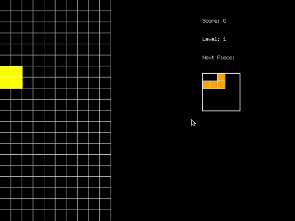

# Tetris Development Guide: Implementing Game UI and TextureManager

In this guide, we'll walk through the process of adding a Game UI and a TextureManager to our Tetris game. These additions will enhance the visual feedback and manage game assets more efficiently.

## 1. Implementing TextureManager

First, let's create a TextureManager to handle textures and fonts efficiently.

### Step 1: Create TextureManager.hpp

Create a new file `Graphics/include/TextureManager.hpp`:

```c++
#pragma once
#include <SFML/Graphics.hpp>
#include <unordered_map>
#include <string>

class TextureManager {
public:
  static TextureManager& getInstance();
  bool loadTexture(const std::string& name, const std::string& filename);
  sf::Texture* getTexture(const std::string& name);
  bool loadFont(const std::string& name, const std::string& filename);
  sf::Texture* getFont(const std::string& name);
  void drawText(const std::string& text, unsigned short x, unsigned short y, sf::RenderWindow& window);

private:
  TextureManager() = default;
  std::unordered_map<std::string, sf::Texture> m_textures;
  std::unordered_map<std::string, sf::Texture> m_fonts;
};
```

### Step 2: Implement TextureManager.cpp

Create a new file `Graphics/src/TextureManager.cpp`:

```c++
#include "TextureManager.hpp"

TextureManager& TextureManager::getInstance() {
  static TextureManager instance;
  return instance;
}

bool TextureManager::loadTexture(const std::string& name, const std::string& filename) {
  sf::Texture texture;
  if (!texture.loadFromFile(filename)) {
    return false;
  }
  m_textures[name] = texture;
  return true;
}

sf::Texture* TextureManager::getTexture(const std::string& name) {
  auto it = m_textures.find(name);
  if (it != m_textures.end()) {
    return &it->second;
  }
  return nullptr;
}

bool TextureManager::loadFont(const std::string& name, const std::string& filename) {
  sf::Texture font;
  if (!font.loadFromFile(filename)) {
    return false;
  }
  m_fonts[name] = font;
  return true;
}

sf::Texture* TextureManager::getFont(const std::string& name) {
  auto it = m_fonts.find(name);
  if (it != m_fonts.end()) {
    return &it->second;
  }
  return nullptr;
}

void TextureManager::drawText(const std::string& text, unsigned short x, unsigned short y, sf::RenderWindow& window) {
  sf::Texture* fontTexture = getFont("default");
  if (!fontTexture) return;

  unsigned char characterWidth = fontTexture->getSize().x / 96;
  sf::Sprite characterSprite(*fontTexture);

  for (const char a : text) {
    if (a == '\n') {
      x = x;  // Reset to initial x position
      y += fontTexture->getSize().y;
      continue;
    }

    characterSprite.setPosition(x, y);
    characterSprite.setTextureRect(sf::IntRect(characterWidth * (a - 32), 0, characterWidth, fontTexture->getSize().y));
    window.draw(characterSprite);

    x += characterWidth;
  }
}
```

**Why?**
- We use the Singleton pattern to ensure only one instance of TextureManager exists.
- We provide methods to load and retrieve textures and fonts.
- The `drawText` method allows us to render text using a sprite font.

## 2. Implementing Game UI

Now, let's create a GameUI class to manage the game's user interface.

### Step 1: Create GameUI.hpp

Create a new file `GameUI.hpp`:

```c++
#pragma once
#include <SFML/Graphics.hpp>
#include "GameState.hpp"
#include "TextureManager.hpp"

class GameUI {
public:
  GameUI();
  void update(const GameState& gameState);
  void draw(sf::RenderWindow& window);
  void showGameOver();
  void showPaused();

private:
  int m_score;
  int m_level;
  Tetromino::Type m_nextPieceType;
  bool m_isGameOver;
  bool m_isPaused;

  sf::RectangleShape m_nextPiecePreview;
  std::vector<sf::RectangleShape> m_nextPieceBlocks;

  void updateScoreText(int score);
  void updateLevelText(int level);
  void updateNextPiecePreview(Tetromino::Type nextPieceType);
  void drawNextPiece(sf::RenderWindow& window);
};
```

### Step 2: Implement GameUI.cpp

Create a new file `GameUI.cpp`:

```c++
#include "GameUI.hpp"

namespace {
    const float BLOCK_SIZE = 20.0f;
    const sf::Vector2f NEXT_PIECE_POSITION(550.0f, 200.0f);
    const std::array<sf::Color, 7> TETROMINO_COLORS = {
        sf::Color::Cyan,   // I
        sf::Color::Yellow, // O
        sf::Color(128, 0, 128),  // T (Purple)
        sf::Color::Green,  // S
        sf::Color::Red,    // Z
        sf::Color::Blue,   // J
        sf::Color(255, 165, 0)   // L (Orange)
    };
}

GameUI::GameUI()
    : m_score(0)
    , m_level(1)
    , m_nextPieceType(Tetromino::Type::I)
    , m_isGameOver(false)
    , m_isPaused(false)
{
    m_nextPiecePreview.setSize(sf::Vector2f(5 * BLOCK_SIZE, 5 * BLOCK_SIZE));
    m_nextPiecePreview.setPosition(NEXT_PIECE_POSITION);
    m_nextPiecePreview.setFillColor(sf::Color::Black);
    m_nextPiecePreview.setOutlineColor(sf::Color::White);
    m_nextPiecePreview.setOutlineThickness(2);
}

void GameUI::update(const GameState& gameState) {
    updateScoreText(gameState.getScoreManager().getScore());
    updateLevelText(gameState.getScoreManager().getLevel());
    updateNextPiecePreview(gameState.getNextTetromino().getType());
}

void GameUI::draw(sf::RenderWindow& window) {
    TextureManager& textureManager = TextureManager::getInstance();

    textureManager.drawText("Score: " + std::to_string(m_score), 550, 50, window);
    textureManager.drawText("Level: " + std::to_string(m_level), 550, 100, window);
    textureManager.drawText("Next Piece:", 550, 150, window);

    window.draw(m_nextPiecePreview);
    drawNextPiece(window);

    if (m_isGameOver) {
        textureManager.drawText("GAME OVER", 300, 250, window);
        textureManager.drawText("Press Enter to restart", 250, 300, window);
    }

    if (m_isPaused) {
        textureManager.drawText("PAUSED", 350, 250, window);
        textureManager.drawText("Press P to resume", 300, 300, window);
    }
}

// ... (implement other methods)
```

**Why?**
- We create a separate class for the UI to keep our main game logic clean.
- We use the TextureManager to draw text and manage assets.
- We provide methods to update and draw the UI, including score, level, next piece preview, and game state messages.

## 3. Integrating GameUI into the Game Class

### Step 1: Update Game.hpp

Modify `Game.hpp`:

```c++
#pragma once

#include <SFML/Graphics.hpp>
#include "GameState.hpp"
#include "TetrominoEntity.hpp"
#include "BoardEntity.hpp"
#include "Renderer.hpp"
#include "Camera.hpp"
#include "GameUI.hpp"

enum class GameMode {
  Playing,
  Paused,
  GameOver
};

class Game {
public:
  Game();
  void run();

private:
  // ... (other methods)

  sf::RenderWindow m_window;
  Renderer m_renderer;
  Camera m_camera;
  GameState m_gameState;

  TetrominoEntity m_currentTetrominoEntity;
  BoardEntity m_boardEntity;

  GameUI m_gameUI;
  GameMode m_gameMode;
  sf::Clock m_clock;
  float m_deltaTime;
};
```

### Step 2: Update Game.cpp

Modify `Game.cpp`:

```c++
#include "Game.hpp"

Game::Game()
    : m_window(sf::VideoMode(800, 600), "TetrisSFML")
    , m_renderer(m_window)
    , m_camera(800.f, 600.f)
    , m_currentTetrominoEntity(m_gameState.getCurrentTetromino())
    , m_boardEntity(m_gameState.getBoard())
    , m_gameMode(GameMode::Playing)
    , m_deltaTime(0.f)
{
    initializeGame();
}

void Game::update(float deltaTime) {
    if (m_gameMode == GameMode::Playing) {
        m_gameState.update(deltaTime);
        updateEntities();
        m_gameUI.update(m_gameState);
        checkGameOver();
    }
}

void Game::render() {
    m_renderer.beginDraw();

    m_boardEntity.draw(m_window);
    m_currentTetrominoEntity.draw(m_window);
    m_gameUI.draw(m_window);

    m_renderer.endDraw();
}

// ... (implement other methods)
```

## 4. Updating the Build System

### Step 1: Update Graphics/CMakeLists.txt

```cmake
add_library(TetrisGraphics
        src/Renderer.cpp
        src/Camera.cpp
        src/TextureManager.cpp
)

target_include_directories(TetrisGraphics PUBLIC include)
target_link_libraries(TetrisGraphics PUBLIC sfml-graphics TetrisEntity)
```

### Step 2: Update main CMakeLists.txt

```cmake
add_executable(Tetris
        main.cpp
        Game.cpp
        GameUI.cpp
)

# ... (other configurations)

add_custom_command(
        TARGET Tetris POST_BUILD
        COMMAND ${CMAKE_COMMAND} -E copy_directory
        ${CMAKE_SOURCE_DIR}/Res $<TARGET_FILE_DIR:Tetris>/Res
)
```

**Why?**
- We add TextureManager.cpp to the TetrisGraphics library.
- We add GameUI.cpp to the main executable.
- We add a custom command to copy resource files (like fonts) to the build directory.

## Result

With these changes, we've successfully implemented a Game UI and TextureManager in our Tetris game:

1. We've created a TextureManager to efficiently handle textures and fonts.
2. We've implemented a GameUI class to manage and render the game's user interface.
3. We've integrated the GameUI into our main Game class.
4. We've updated our build system to include the new files and copy necessary resources.

