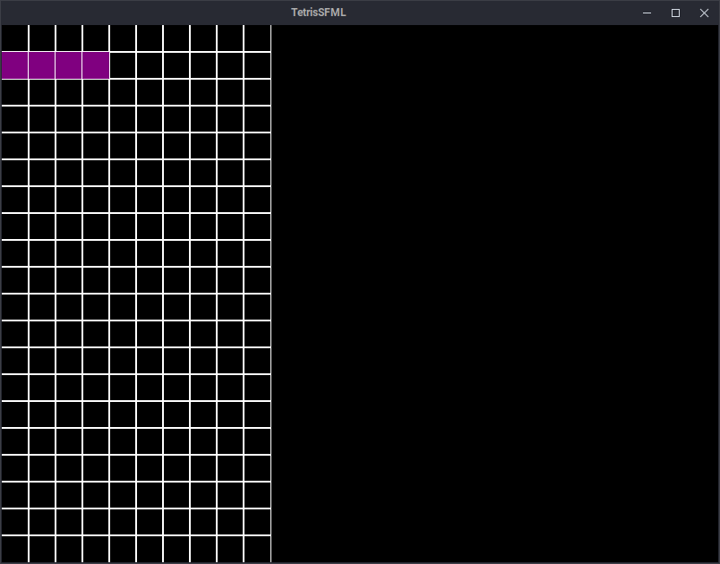

# Guided Tetris Development: Adding Tetromino

In this guide, we'll walk through the process of adding Tetrominos to our Tetris game. We'll cover why each step is necessary and how it contributes to the overall game development.

## 1. Core Game Logic

### 1.1 Update CMakeLists.txt

First, open `Core/CMakeLists.txt` and add `src/Tetromino.cpp` to the `TetrisCore` library:

```cmake
add_library(TetrisCore
    src/Board.cpp
    src/GameState.cpp
    src/Tetromino.cpp
)
```

**Why?** This step ensures that our build system knows about the new Tetromino source file and includes it in the compilation process.

### 1.2 Modify GameState Class

Open `Core/include/GameState.hpp` and update it:

```c++
#pragma once

#include <Board.hpp>
#include <Tetromino.hpp>

class GameState
{
public:
    GameState();

    const Board& getBoard() const { return board; }
    const Tetromino& getCurrentTetromino() const { return currentTetromino; }

private:
    Board board;
    Tetromino currentTetromino;
};
```

**Why?** We're adding a Tetromino to our game state because in Tetris, there's always a current piece that the player is controlling. This modification allows us to keep track of that piece.

### 1.3 Create Tetromino Class

Create a new file `Core/include/Tetromino.hpp`:

```c++
#pragma once
#include <vector>
#include <array>

class Tetromino
{
public:
    Tetromino();
    const std::vector<std::array<int, 2>>& getBlocks() const { return blocks; }
private:
    std::vector<std::array<int, 2>> blocks;
};
```

**Why?** This class represents a single Tetromino piece. We use a vector of 2D integer arrays to represent the blocks because each Tetromino is made up of four blocks, each with an x and y coordinate relative to the Tetromino's center.

### 1.4 Implement Tetromino

Create `Core/src/Tetromino.cpp`:

```c++
#include "Tetromino.hpp"

Tetromino::Tetromino()
{
    blocks = { {0, 1}, {1, 1}, {2, 1}, {3, 1} }; // Render 'I'
}
```

**Why?** This implementation creates an 'I' shaped Tetromino. In a full game, you'd randomly generate different shapes, but this is a good starting point.

## 2. Entity Representation

### 2.1 Update Entity CMakeLists.txt

Open `Entity/CMakeLists.txt` and add `src/TetrominoEntity.cpp`:

```cmake
add_library(TetrisEntity
    src/Entity.cpp
    src/BoardEntity.cpp
    src/TetrominoEntity.cpp
)
```

**Why?** Just like with the core logic, we need to tell our build system about the new TetrominoEntity source file.

### 2.2 Create TetrominoEntity Class

Create `Entity/include/TetrominoEntity.hpp`:

```c++
#pragma once
#include "Entity.hpp"
#include "Tetromino.hpp"

class TetrominoEntity : public Entity {
public:
    TetrominoEntity(const Tetromino& tetromino);

    void draw(sf::RenderWindow& window) const override;
    void update(float deltaTime) override;
    void updateFromTetromino(const Tetromino& tetromino);

private:
    std::vector<sf::RectangleShape> m_blocks;
    sf::Color m_color;
};
```

**Why?** This class bridges the gap between our game logic (Tetromino) and its visual representation. It inherits from Entity so it can be easily integrated into our rendering system.

### 2.3 Implement TetrominoEntity

Create `Entity/src/TetrominoEntity.cpp`:

```c++
#include "TetrominoEntity.hpp"

namespace {
const float BLOCK_SIZE = 30.0f;
const std::array<sf::Color, 7> TETROMINO_COLORS = {
    sf::Color::Cyan,   // I
    sf::Color::Yellow, // O
    sf::Color(128, 0, 128), // T (Purple)
    sf::Color::Green,  // S
    sf::Color::Red,    // Z
    sf::Color::Blue,   // J
    sf::Color(255, 165, 0)  // L (Orange)
};
}

TetrominoEntity::TetrominoEntity(const Tetromino& tetromino) {
    updateFromTetromino(tetromino);
}

void TetrominoEntity::draw(sf::RenderWindow& window) const {
    for (const auto& block : m_blocks) {
        window.draw(block);
    }
}

void TetrominoEntity::update(float deltaTime) {
    // Not needed for now
}

void TetrominoEntity::updateFromTetromino(const Tetromino& tetromino) {
    m_blocks.clear();
    m_color = TETROMINO_COLORS[2]; // Index of the color

    for (const auto& block : tetromino.getBlocks()) {
        sf::RectangleShape shape(sf::Vector2f(BLOCK_SIZE, BLOCK_SIZE));
        shape.setPosition(block[0] * BLOCK_SIZE, block[1] * BLOCK_SIZE);
        shape.setFillColor(m_color);
        shape.setOutlineColor(sf::Color::White);
        shape.setOutlineThickness(1.0f);
        m_blocks.push_back(shape);
    }
}
```

**Why?** This implementation handles the visual aspects of the Tetromino. We define colors for each Tetromino shape and create SFML shapes to represent each block. The `updateFromTetromino` method allows us to sync the visual representation with the logical one.

## 3. Game Integration

### 3.1 Update Game Class

Modify `Game.hpp`:

```c++
#pragma once
#include <BoardEntity.hpp>
#include <GameState.hpp>
#include <Renderer.hpp>
#include <SFML/Graphics.hpp>
#include <TetrominoEntity.hpp>

class Game
{
public:
    Game();
    void run();

private:
    // ... (other methods)

    sf::RenderWindow m_window;
    Renderer m_renderer;
    Camera m_camera;
    GameState m_gameState;
    BoardEntity m_boardEntity;
    TetrominoEntity m_currentTetrominoEntity;
};
```

**Why?** We're adding the TetrominoEntity to our main Game class so we can manage and render it alongside other game elements.

### 3.2 Implement Game Changes

Update `Game.cpp`:

```c++
#include "Game.hpp"

Game::Game()
    : m_window(sf::VideoMode(800, 600), "TetrisSFML"),
      m_boardEntity(m_gameState.getBoard()),
      m_renderer(m_window),
      m_camera(800.f, 600.f),
      m_currentTetrominoEntity(m_gameState.getCurrentTetromino())
{
    initializeGame();
}

// ... (other methods remain the same)

void Game::render()
{
    m_renderer.beginDraw();

    m_boardEntity.draw(m_window);
    m_currentTetrominoEntity.draw(m_window);

    m_renderer.endDraw();
}
```

**Why?** We're initializing the TetrominoEntity with the current Tetromino from our game state, and we've updated the render method to draw both the board and the current Tetromino.

## Result

By following these steps, you've successfully added Tetrominos to your Tetris game. You've created the core logic for Tetrominos, implemented their visual representation, and integrated them into the main game loop.

